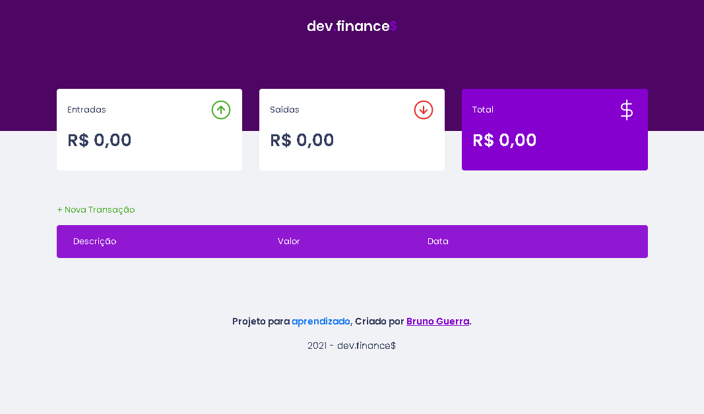
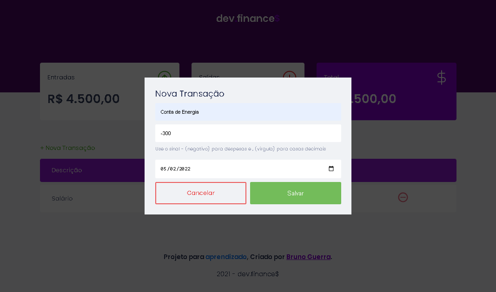
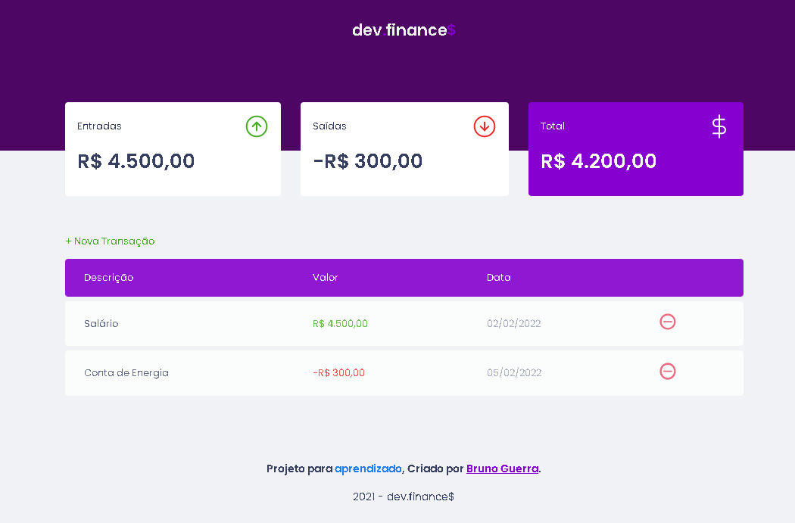

## DevFinances

Rocketseat Training Project. "Discover" Trail; Web application. for finance control.

## Technology

Here are the technologies used in this project.

- HTML5
- CSS3
- Javascript

## Services Used

- Github
- Netlify

## Getting started

- Dependency

- none, just download and use

## How to use

### 1 - Home

### 2 - Add a transaction (credit)

### 3 - Add a transaction (debit)

### 4 - Total transaction

## Features

The main features of the application are:

- LocalStorage function for local storage

## Links

- Deploy on Netlify: https://js-devfinances.netlify.app/
- Repository: https://github.com/brunorguerra/discover-devfinances

## Versioning

1.0.0.0

## Authors

- **Bruno Bernardes Guerra**

Please follow github and join us!
Thanks to visiting me and good coding!
